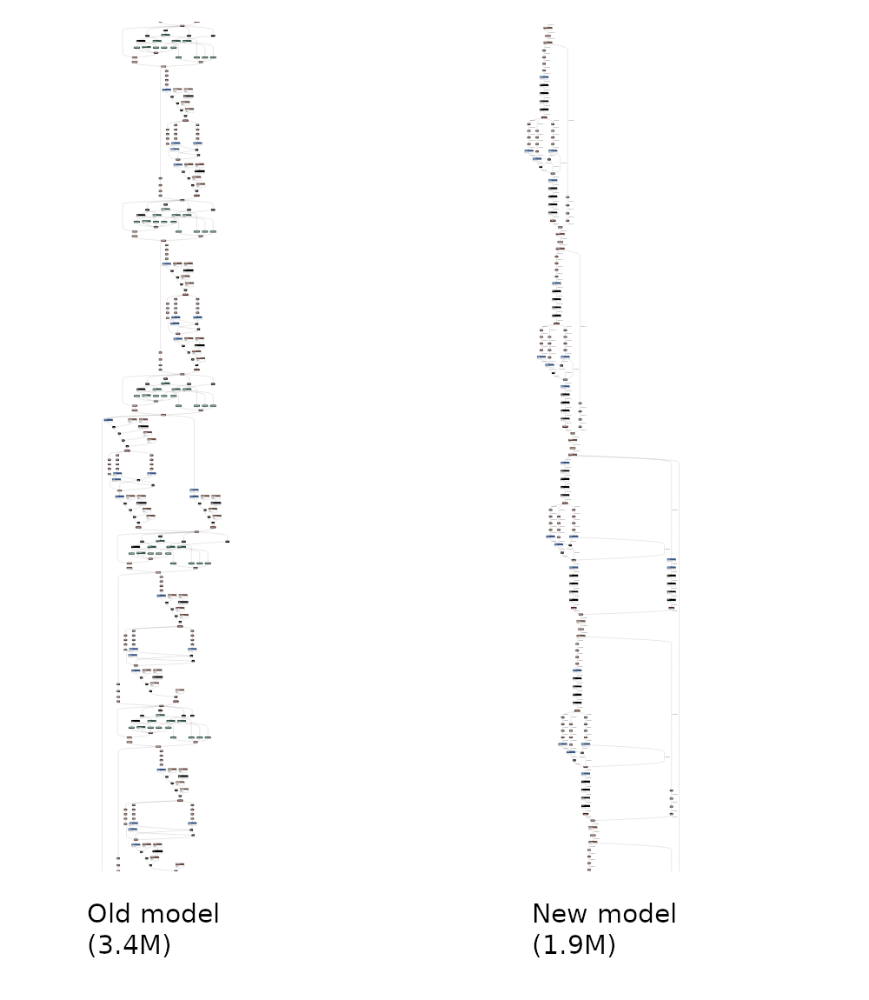

# TensorRT Conversion

<h3 style="color:#ac5353;"> PyTorch -> ONNX -> TensorRT </h3>

This repo includes installation guide for TensorRT, how to convert PyTorch models to ONNX format and run inference with TensoRT Python API.

The following table compares the speed gain got from using TensorRT running [YOLOv5](https://github.com/ultralytics/yolov5).

Device/ Env | PyTorch (FP16) | TensorRT (FP16)
--- | --- | ---
RTX 2060 | 60-61 | 96-97
Jetson Xavier | 17-18 | 38-39

*Notes: YOLO model in comparison is using YOLOv5-L with image size of 352x416. Units are in FPS.*

Example conversion of YOLOv5 PyTorch Model to TensorRT is described in `examples` folder.


## Installation

Recommended CUDA version is

* cuda-10.2 + cuDNN-7.6


Tested environments:

* CUDA 10.2 + cuDNN 7.6
* TensorRT 7.0.0.11
* ONNX 1.7
* ONNXRuntime 1.3
* Protobuf >= 3.12.3
* CMake 3.15.2/ CMake 3.17.3
* PyTorch 1.5 + CUDA 10.2

### Protobuf

Only Protobuf version >= 3.12.3 is supported in ONNX_TENSORRT package. So, you need to build the latest version from source.

To build protobuf from source, the following tools are needed:

```bash
sudo apt install autoconf automake libtool curl make g++ unzip
```

Clone protobuf repository and make sure to also clone submodules and generated the configure script.

```bash
git clone --recursive https://github.com/protocolbuffers/protobuf.git
cd protobuf
./autogen.sh
./configure --prefix=/usr
make -j$(nproc)
sudo make install 
sudo ldconfig # refresh shared library cache
```

Verify the installation:

```bash
protoc --version
```

You should see the installed libprotoc version.

### NVIDIA Driver

First detect your graphics card model and recommended driver.

```bash
ubuntu-drivers devices
```

If you don't find your desired driver version, you can enable Nvidia beta driver repository.

```bash
sudo add-apt-repository ppa:graphics-drivers/ppa
```

Then install the desired driver version using:

```bash
sudo apt install nvidia-driver-440
sudo reboot
```

### CUDA 

Go to [CUDA toolkit archive](https://developer.nvidia.com/cuda-toolkit-archive) and download your desired CUDA version and installation method.

Below is the sample installation method for CUDA 10.2 deb file.

```bash
wget https://developer.download.nvidia.com/compute/cuda/repos/ubuntu1804/x86_64/cuda-ubuntu1804.pin
sudo mv cuda-ubuntu1804.pin /etc/apt/preferences.d/cuda-repository-pin-600
wget http://developer.download.nvidia.com/compute/cuda/10.2/Prod/local_installers/cuda-repo-ubuntu1804-10-2-local-10.2.89-440.33.01_1.0-1_amd64.deb
sudo dpkg -i cuda-repo-ubuntu1804-10-2-local-10.2.89-440.33.01_1.0-1_amd64.deb
sudo apt-key add /var/cuda-repo-10-2-local-10.2.89-440.33.01/7fa2af80.pub
sudo apt-get update
sudo apt-get -y install cuda
```

Check using:

```bash
nvcc -V
```

### cuDNN

Go to [NVIDIA cuDNN](https://developer.nvidia.com/cudnn) and download your desired cuDNN version.

You need to download `cuDNN Runtime Library` and `Developer Library`. `Code Samples and User Guide` is not essential.

Then install step by step:

```bash
sudo dpkg -i libcudnn8_x.x.x-1+cudax.x_amd64.deb
sudo dpkg -i libcudnn8-dev_8.x.x.x-1+cudax.x_amd64.deb
```


### TensorRT 

Download TensorRT from the following link:

https://developer.nvidia.com/tensorrt

Be careful to download to match with your CUDA install method. For example, if you installed CUDA with deb file, download TensorRT deb file also. Otherwise, it won't work.

The following example will install TensorRT deb file method. For other version of TensoRT installation, please check [official documentation](https://docs.nvidia.com/deeplearning/tensorrt/archives/tensorrt-713/install-guide/index.html#installing).

```bash
os="ubuntu1x04"
tag="cudax.x-trt7.x.x.x-ga-yyyymmdd"
sudo dpkg -i nv-tensorrt-repo-${os}-${tag}_1-1_amd64.deb

sudo apt-key add /var/nv-tensorrt-repo-${tag}/7fa2af80.pub

sudo apt-get update
sudo apt-get install tensorrt cuda-nvrtc-x-y
```

Where x-y for cuda-nvrtc is 10-2 or 11-0 depending on your CUD version. 

If you plan to use TensorRT with TensorFlow, install this:

```bash
sudo apt install uff-converter-tf
```

Verify the installation with 

```bash
dpkg -l | grep TensorRT
```

You should see libnvinfer, tensorrt and other related packages installed.


### PyCUDA

PyCUDA is used within Python wrappers to access NVIDIA’s CUDA APIs.

Install PyCUDA with the following command:

```bash
pip3 install pycuda
```

If you faced this `error: command 'aarch64-linux-gnu-gcc' failed with exit status 1`, install like this: `pip3 install pycuda --user`.

If you cannot access cuda driver with PyCUDA, please uninstall PyCUDA, clean pip cache and install PyCUDA again.

```bash
pip3 cache purge
```

To use the above command `pip3 cache purge`, you need to have pip version >= 20.x.x.


### CMake

CMake >= 3.13 is required but on Ubuntu 18.04, installed version is 3.10.2. So, upgrade CMake.

Download latest CMake from [here](https://github.com/Kitware/CMake/releases).

Install OpenSSL:

```bash
sudo apt install libssl-dev
```

Then, install:

```bash
tar -xvzf cmake-3.x.x.tar.gz
cd cmake-3.x.x
./bootstrap
make -j$(nproc)
sudo make install
```

Verify the installation:

```bash
cmake --version
```

### ONNX_TensorRT

Parses ONNX models for execution with TensorRT.

Install Pre-requisities:

```bash
sudo apt install swig
```

Install ONNX_TRT:

```bash
git clone https://github.com/onnx/onnx-tensorrt
cd onnx-tensorrt
git submodule update --init --recursive
mkdir -p build && cd build
cmake .. -DTENSORRT_ROOT=/usr/src/tensorrt
make -j$(nproc)
sudo make install
cd ..
sudo python3 setup.py build
sudo python3 setup.py install
```

Possible errors when running `setup.py`:
* `error: command 'swig' failed with exit status 1`. To fix this, do the following: Add `#define TENSORRTAPI` at the top of `NvOnnxParser.h`.
* `error: command 'aarch64-linux-gnu-gcc' failed with exit status 1`. This error will be occurred on Jetson platforms. To fix: Delete `'-m64,'` line in `setup.py` and try to re-build.


### trtexec

A command line wrapper tool to serve two main purposes: benchmarking networks on random data and generating serialized engines from models. 

`trtexec` can build engines from models in Caffe, UFF (TensorFlow), or ONNX format.

`trtexec` is included when you installed TensorRT but not enabled. You need to build to use it.

Switch to this `trtexec` directory and build it:

```bash
cd /usr/src/tensorrt/samples/trtexec/
sudo make
```

Then, the binary named `trtexec` will be created in `<TensorRT root directory>/bin`. Add this path in `.bashrc`.

```bash
gedit ~/.bashrc

export PATH=$PATH:/usr/src/tensorrt/bin

source ~/.bashrc
```

### ONNX

```bash
pip3 install onnx
```

### ONNXRuntime

CPU:

```bash
pip3 install onnxruntime
```

GPU

```bash
pip3 install onnxruntime-gpu
```

### ONNX Simplifier


```bash
pip3 install onnx-simplifier
```

## Conversion

### PyTorch to ONNX

Run `onnx_export.py`.

Detail steps are as follows:

Load the PyTorch Model.

```python
device = torch.device('cuda' if torch.cuda.is_available() else 'cpu')
model = Model()
model.load_state_dict(torch.load(model_path, map_location=device))
model.to(device).eval()
```

Prepare the input:

```python
img = torch.zeros((1, 3, height, width)).to(device)
```

Note that height and width is fixed. Dynamic input shape is still not available in PyTorch >> ONNX >> TensorRT.

Export to ONNX format:

```python
torch.onnx.export(
    model,                  # PyTorch Model
    img,                    # Input tensor
    f,                      # Output file (eg. 'output_model.onnx')
    opset_version=12,       # Operator support version
    input_names=['image']   # Input tensor name (arbitary)
    output_names=['output'] # Output tensor name (arbitary)
)
```

`opset_version` is very important. Some PyTorch operators are still not supported in ONNX even if `opset_version=12`. Default `opset_version` in PyTorch is 12. Please check official ONNX repo for supported PyTorch operators. If your model includes unsupported operators, convert to supported operators. For example, `torch.repeat_interleave()` is not supported, it can be converted into supported `torch.repeat() + torch.view()` to achieve the same function.

### ONNX Simplifier

`onnxsim` will be used to simplify the exported ONNX model. This `onnxsim` will strip some unnecessary operations and will reduce the number of layers. Moreover, it will get rid of unsupported operators when converting to TensorRT.

An example before and after simplification from official repo is shown below:



It includues optimizers from `onnx.optimizer`, eliminate constant nodes and can run with 3 versions:

#### Web Version

Open official published https://convertmodel.com page and choose ONNX as the output format and convert it.

#### Commandline Version

If the web version won't work well, run the following command to simplify the ONNX model:

```bash
python3 -m onnxsim <input_onnx_model> <output_onnx_model>
```

For more available functions this command can do like skipping optimization and others:

```bash
python3 -m onnxsim -h
```

#### Python In-Script Version

```python
import onnx
from onnxsim import simplify

onnx_model = onnx.load(f)
simplified_model, check = simplify(onnx_model)

assert check, "Simplified ONNX model could not be validated."

onnx.save(simplified_model, 'onnx_model_simplified.onnx')
```

After all, check the exported ONNX model:

```python
onnx.checker.check_model(simplified_model)
print(onnx.helper.printable_graph(simplified_model.graph))  # print a human readable representation of the graph
```

You can view the ONNX model with this tool [Netron](https://github.com/lutzroeder/netron).

*Note*: Don't convert PyTorch to ONNX on Jetson; it will take more GPU memory usage. Try to do this on host PC. Sometimes, commandline method won't work, so recommended method is In-script version.


### ONNX to TensorRT with onnx-tensorrt

**ONNX-TensorRT** package installed above will be used to convert the ONNX model (`.onnx`) to Tensort model (`.trt`).

You can also run `.onnx` model directly with TensorRT Python API but converting to `.trt` will be more convenient.

To convert, run the following command in your terminal:

```bash
onnx2trt model.onnx -o model.trt -b 1 -d 16
```

* `-o`: To output TensorRT engine file
* `-b`: Set batch size (default: 32)
* `-d`: Set Model data type (16 for FP16, 32 for FP32)

Please see other available options and their usage on official [repo](https://github.com/onnx/onnx-tensorrt).

*Note*: Converted TRT model on one device will not result the same output on other device. This is more obvious if you use other optimization passes option. Try to run this on each device. 

### ONNX to TensorRT with trtexec

`trtexec` commandline tool can be used to convert the ONNX model instead of `onnx2trt`.

To convert ONNX model, run the following:

```bash
trtexec --onnx=model.onnx --saveEngine=model.trt --workspace=1024 --fp16
```

It also includes model benchmarking and profiling. To see other available options and use cases, check out official [Documentation](https://github.com/NVIDIA/TensorRT/tree/master/samples/opensource/trtexec).


## Run TRT Model

First implement a logging interface through which TensorRT reports errors, warnings and informational messages. 

```python
import tensorrt as trt

TRT_LOGGER = trt.Logger(trt.Logger.WARNING)
```

Then, read the TRT model and deserialize it.

```python
with open('trt_model.trt', 'rb) as f, trt.Runtime(TRT_LOGGER) as runtime:
    engine = runtime.deserialize_cuda_engine(f.read())
```

Allocate some host and device buffers for inputs and outputs.

```python
import pycuda.driver as cuda
import pycuda.autoinit

h_input = cuda.pagelocked_empty(trt.volume(engine.get_binding_shape(0)), dtype=np.float32)
h_output = cuda.pagelocked_empty(trt.volume(engine.get_binding_shape(1)), dtype=np.float32)
# Allocate device memory for inputs and outputs.
d_input = cuda.mem_alloc(h_input.nbytes)
d_output = cuda.mem_alloc(h_output.nbytes)
# Create a stream in which to copy inputs/outputs and run inference.
stream = cuda.Stream()
```

Finally, run inference with created engine:

```python
with engine.create_execution_context() as context:
    # Transfer input data to the GPU.
    cuda.memcpy_htod_async(d_input, h_input, stream)
    # Run inference.
    context.execute_async(bindings=[int(d_input), int(d_output)], stream_handle=stream.handle)
    # Transfer predictions back from the GPU.
    cuda.memcpy_dtoh_async(h_output, d_output, stream)
    # Synchronize the stream
    stream.synchronize()
    # Return the host output. 
    return h_output
```

There is also an option to run ONNX model directly with TensorRT Python API, but it is not recommended.

## Examples

Example conversion of YOLOv5 model into TRT model can be seen in [conversion](conversion).

You can see the example converted models in [examples](examples).

## References

* [YOLOv5](https://github.com/ultralytics/yolov5)
* [TensorRT Documentation](https://docs.nvidia.com/deeplearning/tensorrt/developer-guide/index.html)
* [ONNX](https://github.com/onnx/onnx)
* [ONNX-Runtime](https://github.com/microsoft/onnxruntime)
* [ONNX-TensorRT](https://github.com/onnx/onnx-tensorrt)
* [ONNX Simplifier](https://github.com/daquexian/onnx-simplifier)
* [trtexec](https://github.com/NVIDIA/TensorRT/tree/master/samples/opensource/trtexec)